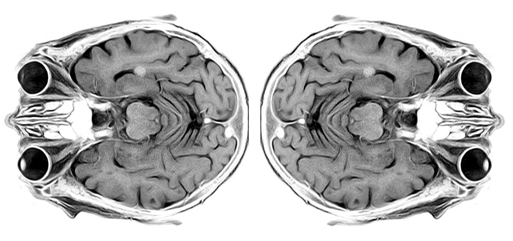
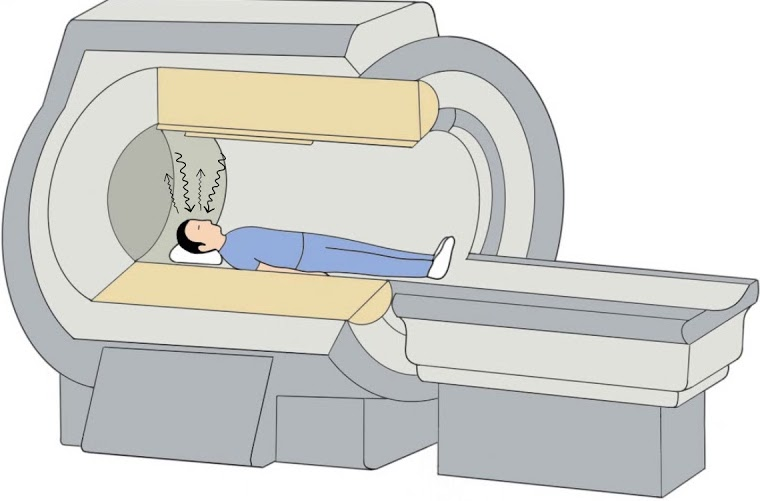
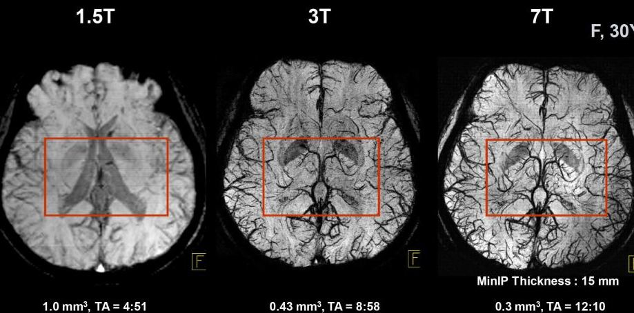
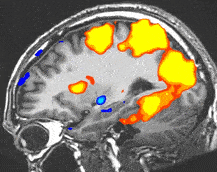
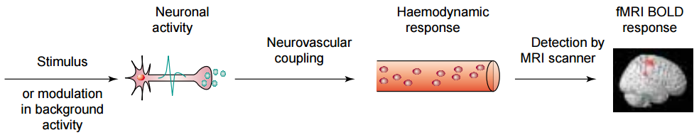
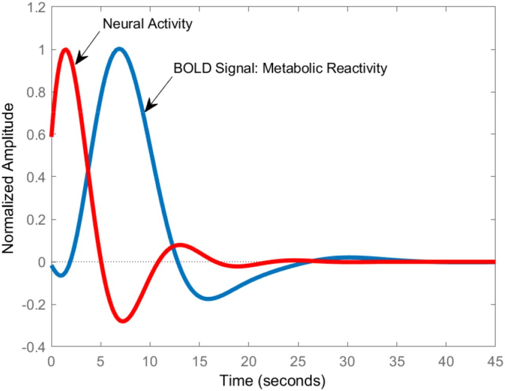
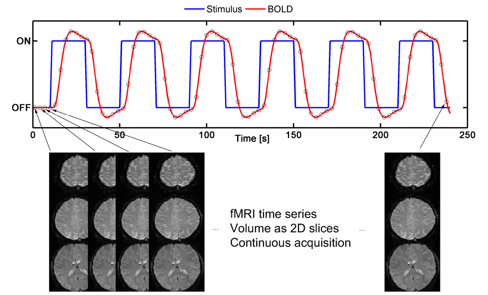
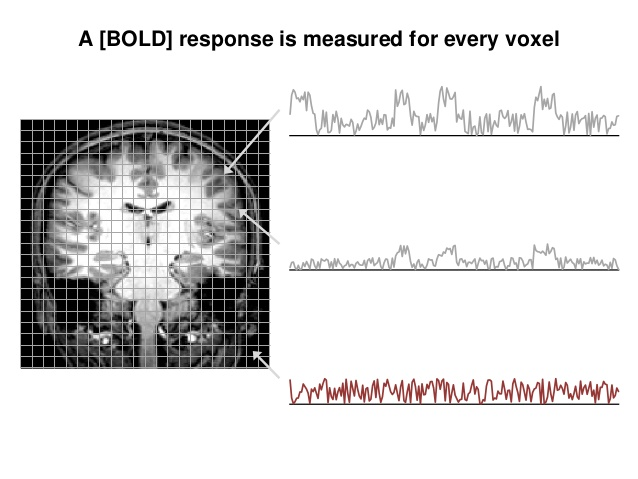
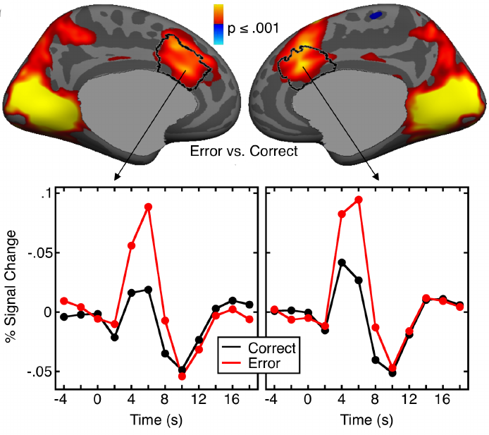
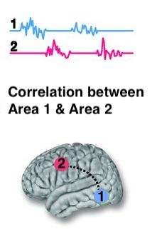

class:  center, middle
```{r setup, include=FALSE}
options(htmltools.dir.version = FALSE)
library(xaringanExtra)
xaringanExtra::use_tile_view()
xaringanExtra::use_tachyons()
xaringanExtra::use_panelset()
xaringanExtra::use_editable()
```


## Neurophysiological Measures

</br>

# fMRI




</br>
</br>


.large[Alessandro Tomassini | Education Tripos Part 1B | 10 February 2021]


---
# Neuroimaging techniques

* Directly or indirectly image the structure, function and pharmacology of the nervous system

* Provide a **non-invasive** window into the brain and its processes *in vivo*

</br>
</br>

**Two broad categories of Neuroimaging techniques:**

  .pull-left[**Structural Imaging**
  
   Deals with the anatomical structure of the    
       nervous system:
    - Magnetic Resonance Imaging (MRI)
    - Computer axial tomography  (CAT)
     ]

.pull-left[**Functional Imaging**

   Deals with the characterisation of brain processes in time and space:
    - f(unctional)MRI
    - Electroencephalography (EEG)
    - Magnetoencephalography (MEG)
     ]


---

# Magnetic Resonance Imaging (MRI) in a Nutshell
.pull-left[
* Involves exposing the brain to multiple magnetic fields

* Hydrogen protons from our bodies respond by emitting an electromagnetic signal

* Scanner receives signal, uses it to create high-resolution images of the brain

* The strength of the magnetic field generated by the scanner is measured in Teslas (T)

* 1T = 20000 times the Earth's magnetic field
* The strength of the magnetic field determines the spatial resolution of the image -->

* The spatial resolution is the size of the imaging voxel in mm (voxel = point in 3D space, cfr with pixel in 2D)
]

.pull-right[

.center[]

</br>


.center[]


]


---

# MRI vs fMRI
* **Functional MRI (fMRI)** is a non-invasive technique for imaging the activation of brain areas in relation to perception, action or high level cognitive functions.

* MRI and  fMRI use the same basic principles of atomic physics.

.pull-left[
### .center[MRI]
* High spatial resolution (voxel's size)
* Generates static images (e.g. a snapshot that captures a specific moment)

.center[]


]

.pull-right[
### .center[fMRI]

* Lower spatial resolution than MRI 
* Generates non-static images (i.e. images of a given duration of time)
* Allows to compare activity from different conditions

.center[]

]


---
# The basis of functional MRI


.panelset[
.panel[.panel-name[A BOLD technique]
**.red[Blood oxygenation level dependent]** (**BOLD**) response: fMRI is very sensitive to oxygen usage in blood flow.

.pull-left[* Neurons have no internal reserves of energy, all energy usage must be compensated immediately

* Active neural regions must be supplied with energy carriers via the blood flow (haemodynamic response)

* The main carrier of energy in all metabolic cycles is oxygen, transported via the blood by means of hemoglobin

* Oxygenated and deoxygenated hemoglobin are associated with different magnetic properties

* This leads to magnetic signal variation that can be detected with an MRI scanner]


.pull-right[




.center[]

]
]
.panel[.panel-name[Repeated measures]
.pull-left[
* Magnetic signal variation linked to changes in hemoglobin in its oxygenated and deoxygenated form are detected.

* Many repetition of a stimulus, action or cognitive task to produce a reliable sample of signals

* Statistical methods can be used to determine significant differences in activation between areas

* Therefore, it can pinpoint those areas most active during the studied condition (e.g. stimulus, action, task)
]

.pull-right[







]


]

.panel[.panel-name[Statistics & blobs]
.pull-left[
* For each voxel, calculate the correspondence between BOLD time series an experimental conditions

</br>


]
.pull-right[
* Voxels with above-threshold correspondence level are colored




: <font size = "3">  *"Agam et al (2014) "Dissociable genetic contributions to error processing: a multimodal neuroimaging study", Plos One* </font>


]

]

.panel[.panel-name[Functional connectivity]
.pull-left[
* However, neural processing implemented through networks of interactions among brain regions

* Functional connectivity: how an experimental manipulation/condition affects coupling between regions

* In its simplest form: correlation between bold time series from remote regions

* e.g. Learning difficulties are due to poor connectivity between regions rather than by changes in specific areas (Siugzdaite et al.2020)


<font size = "3">  *Siugzdaite et al (2020) "Transdiagnostic brain mapping in developmental disorders", Current Biology* </font>
</br>


]
.pull-right[




]

]


]
---
# Pros & cons

.pull-left[
#Strengths

* Unequaled spatial resolution

* Can provide diverse measures within the same session

* Non invasive, does not use ionising radiations

]

.pull-left[
#Limitations

* **Indirect** measure of brain activity (i.e. BOLD response)

* Results could differ across subject groups because of vascularization patterns (e.g. young vs elderly)

* Low temporal resolutions (~4sec vs neural activity in the ms range)

* Subjects cannot move for a relatively long time (difficult with children)

]


---


