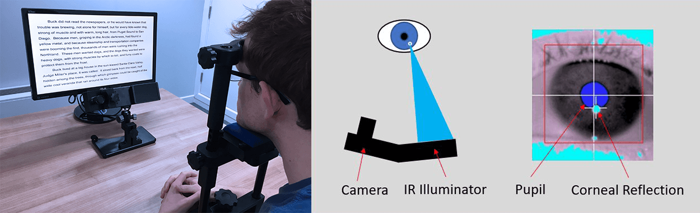

class:  center, middle
```{r setup, include=FALSE}
options(htmltools.dir.version = FALSE)
library(xaringanExtra)
xaringanExtra::use_tile_view()
xaringanExtra::use_tachyons()
xaringanExtra::use_panelset()
xaringanExtra::use_editable()
```


## Neurophysiological Measures

</br>

# Eye-Tracking


</br>
</br>


.large[Alessandro Tomassini | Education Tripos Part 1B | 10 February 2021]

---
# Eye-tracking

A technique to capture ** eye position ** (eg. fixation) and **eye movements** (e.g saccades)
  
  </br>
</br>

.middle[.center[]]

---

# Vision Physiology in a Nutshell

.panelset[

.panel[.panel-name[The eye]
.pull-left[
* Cornea - external transparent structure covers the iris and pupil

* Pupil - the adjustable opening at the center of the **iris** that allows varying amounts of light in the eye

* Lens - flexible structure sitting behind the pupil helps to focus light on the retina

* Retina - sheet of cells sensitive to light (photoreceptors) sitting on the bottom of the eye

* Photoreceptors: cones (6%) and rods (94%) 

* Fovea: depression in the retina with the highest concentration of cones

]

.pull-right[

.center[]


]

]

.panel[.panel-name[The visual field]

.pull-left[
* Cones: 
  - active at high light levels (photopic vision)
  - capable of color vision
  - high spatial acuity
* Rods:
  - responsible for vision at low light levels (scotopic vision)
  - do not mediate color vision
  - low spatial acuity

* Cones predominate in the fovea: visual acuity is highest

* Rods predominate in the periphery: visual acuity decreases with distance from the fovea

 

]

.pull-right[

</br>

</br>
.center[]


]

]


.panel[.panel-name[Fixations]

.pull-left[
* At fixation the eye is (relatively) still and the object fixated is focused in the fovea

* Information from the scene is mainly acquired during fixation

* Fixations typically last from 200-600ms.

* Typical three fixations per second (i.e. 3Hz frequency)

* Interspersed with **saccades**


]

.pull-right[

</br>
</br>
.center[]


]

]

.panel[.panel-name[Saccades]

.pull-left[
* Rapid eye movements that move the line of sight between successive points of fixation

* One of the fastest movement produced by the body - up to 900°/sec in humans, duration ~40-120ms

* Visual perception is suppressed during the saccade (i.e. illusory sense of stability of the scene)

* Ballistic movements: the landing point of the saccade cannot be changed during the movement

* Among the best understood movements

* Popular means to study motor control, cognition, memory


]

.pull-right[

</br>
</br>
.center[]
.center[]


]

]

]

---

# Eye-tracker
.pull-left[
* Different approaches to do eye-tracking

* The most common is infra-red (IR) light  based tracking:
  1. The eye tracker sends out IR light
  
  2. The light is reflected in in your eyes
  
  3. Reflections are picked up by the eye tracker's cameras
  
  4. The eye tracker calculates the position of your glance
]
.pull-right[
.center[]


]


---
# Eye-tracking 
Used to investigate **reading**, **visual attention**, **motor control**, **memory** and **high level cognitive functions**, as well as **mental and neural disorders**.

.panelset[

.panel[.panel-name[Measures]
.pull-left[
* Fixation duration (e.g. as a proxy for difficulty in processing information or novelty)

* Fixation frequency, usually plotted as heat maps (see figure) to show where attention mostly focused:
  - eg. to observe how students look at a page, or skim the page.

* Saccades sequence, to understand the strategy in exploring the visual scene

]

.pull-right[
.center[*Frequency of fixations*]
.center[]

.center[]

]


]


.panel[.panel-name[Pros & Cons]

.pull-left[
#Strengths

* Records the *actual* real-time eye movements

* High sampling rates: accurate and precise data

* Relatively portable

]

.pull-right[
#Limitations

* Cannot track peripheral vision

* Fixation does not necessarily reflect attention

* Not all eyes can be tracked (e.g. contact lenses, glasses)

* Prone to technical problems

]
]

]