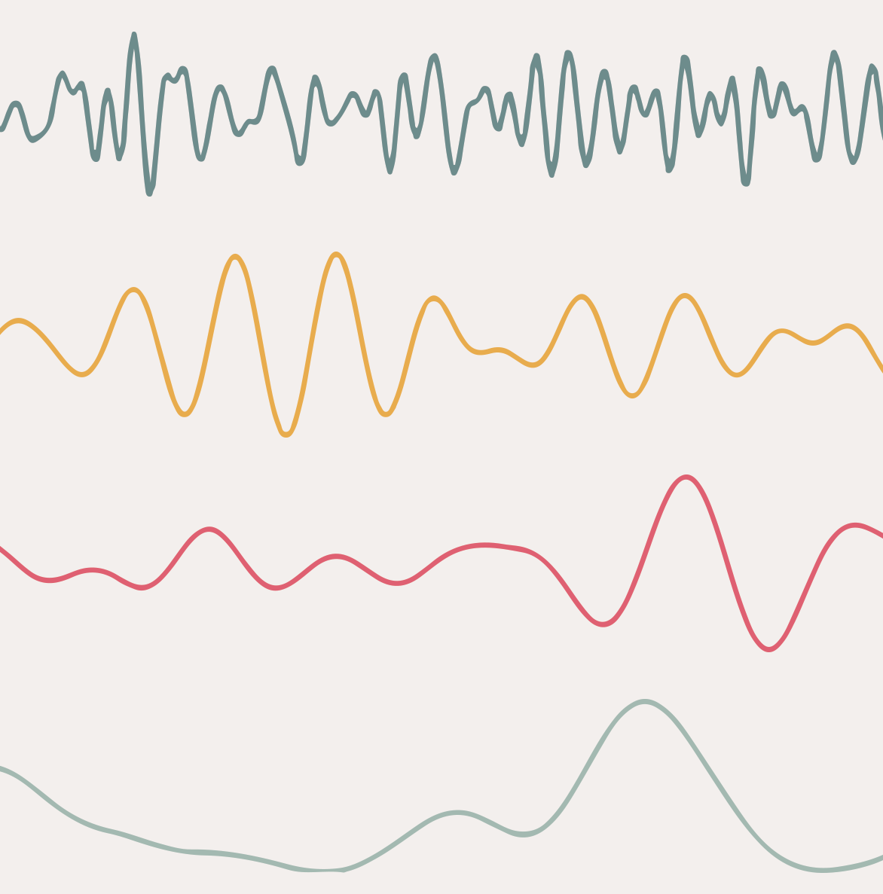
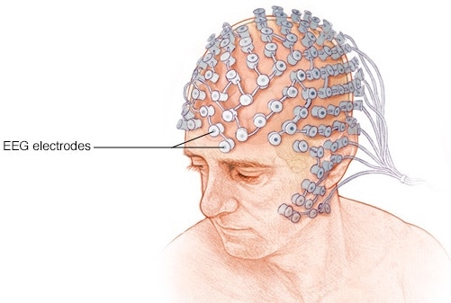
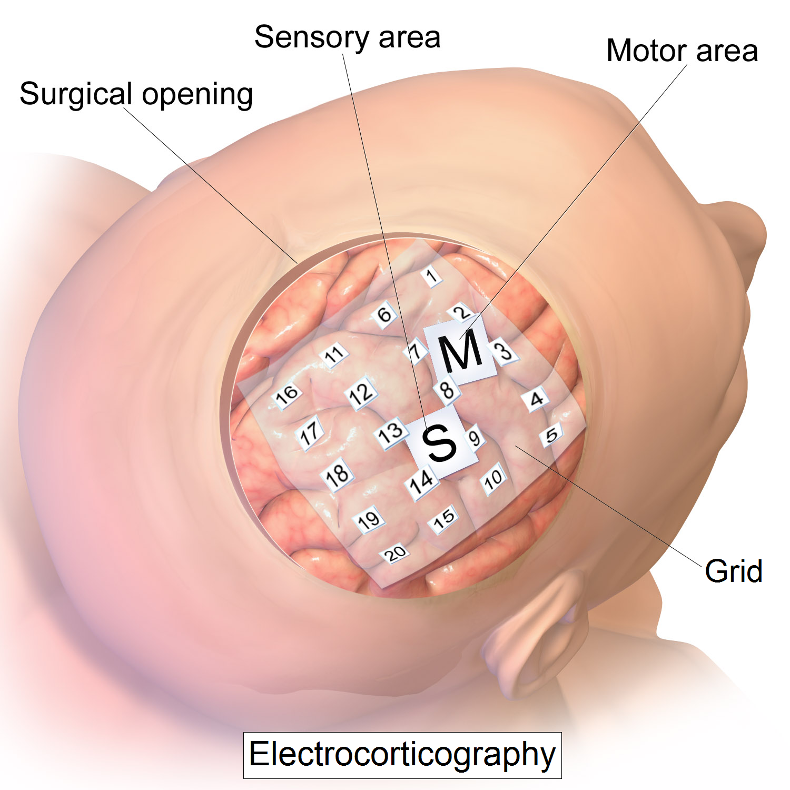
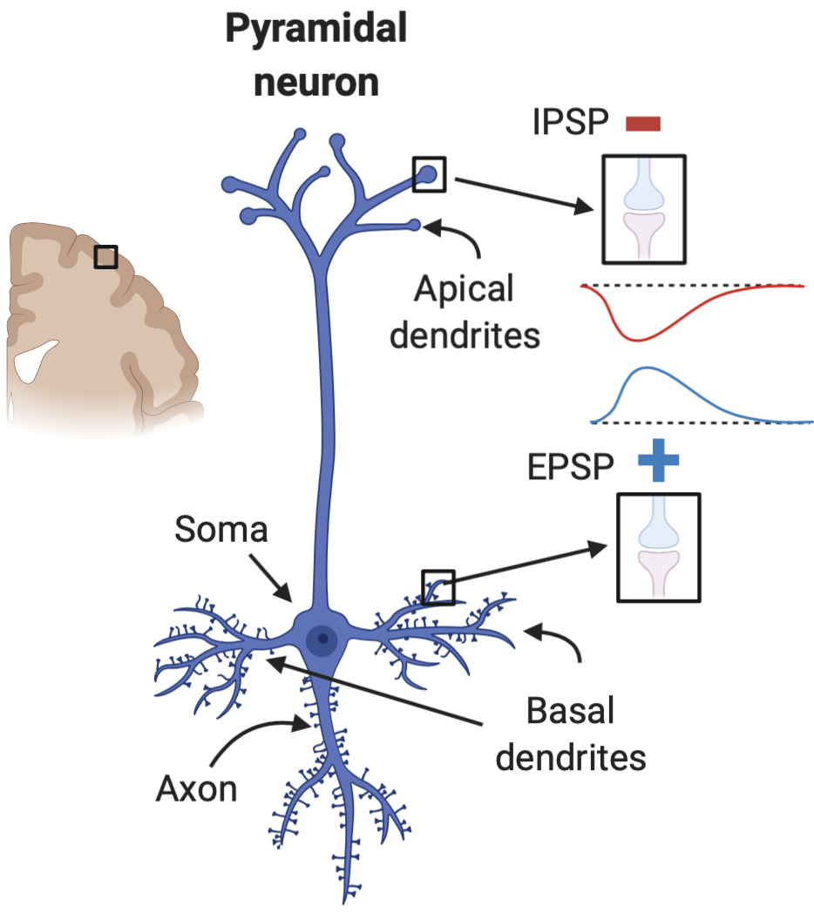
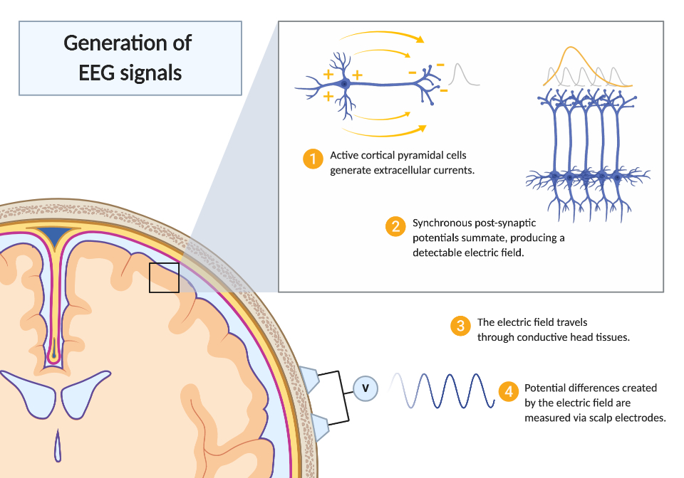
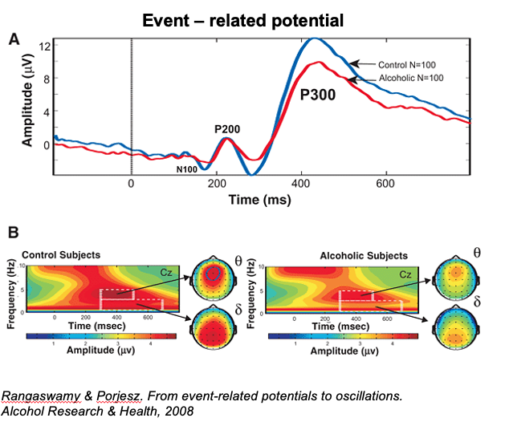
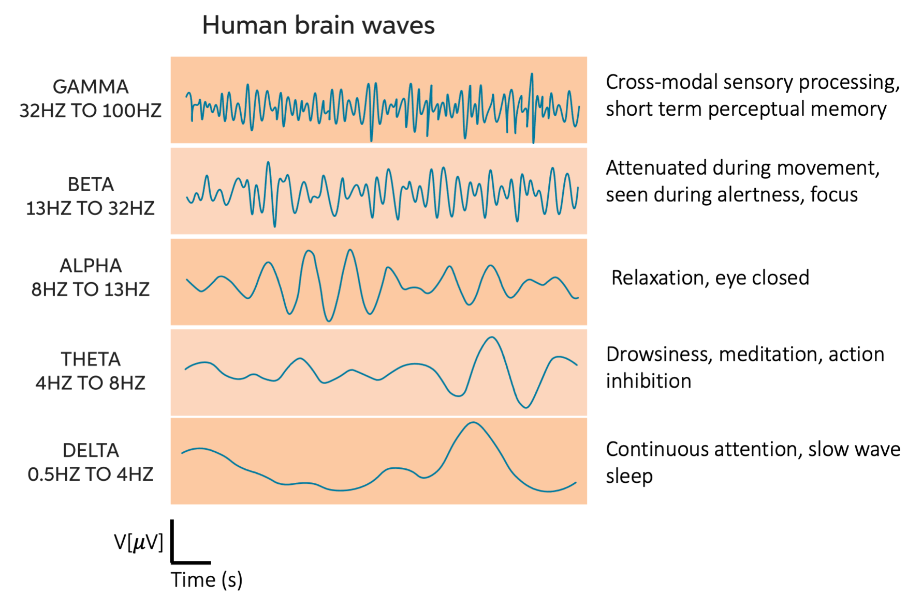
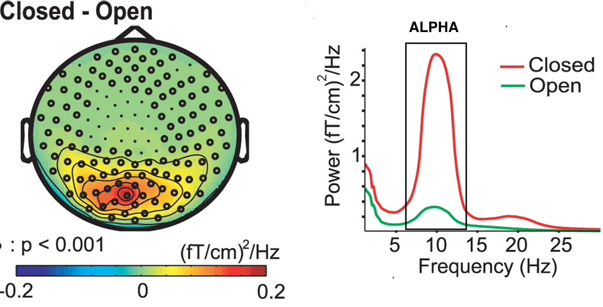

class:  center, middle
```{r setup, include=FALSE}
options(htmltools.dir.version = FALSE)
library(xaringanExtra)
xaringanExtra::use_tile_view()
xaringanExtra::use_tachyons()
xaringanExtra::use_panelset()
xaringanExtra::use_editable()
```


## Neurophysiological Measures

</br>

# EEG




</br>
</br>


.large[Alessandro Tomassini | Education Tripos Part 1B | 10 February 2021]


---
# .red[E]lectro.red[E]ncephalo.red[G]raphy

Electrophysiological technique to record electrical activity of the brain
</br>
</br>

**Two types of EEG:**

.pull-left[
 **Non-invasive EEG (simply called EEG)**
 Electrodes placed over the scalp
 
 


]

.pull-right[
 **Invasive EEG: **
 Electrocorticography (ECOG) or Intracranial EEG.
 Electrods grid implanted in the cortical surface
 


]
---

# Electrophysiology in a Nutshell
.panelset[

.panel[.panel-name[Pyramidal cells]
.pull-left[
* Pyramidal neurons in the cortex make up the majority of the EEG signal

* EEG signal reflects mostly activity of neurons in close proximity to the electrode

* Activity from deep sources is harder to detect as voltage fields fall off as function of distance

* EEG is a summation of non-propagating apical and basal dendritic post-synaptic potentials:
  - *EPSPs*: Excitatory Post Synaptic Potentials
  - *IPSPs*: Inhibitory Post Synaptic Potentials
]

.pull-right[

.center[]


]

]

.panel[.panel-name[Dipoles]

.pull-left[
* Dipole: a pair of electrical charges of opposite sign separated by a small distance

* When an EPSP is generated, a dipole forms between apical and basal dendrites

* Extracellular currents generated by the dipole yield potential differences on the scalp that can be measured by EEG

]

.pull-right[

.center[]


]

]


.panel[.panel-name[Basis of EEG signal]

EEG detects summed **synchronous** activity (EPSPs) from large populations of (mainly) pyramidal cells

.center[

</br>
.center[]

]

]


]


---

# EEG analysis - .red[E]vent-.red[R]elated .red[P]otentials
.panelset[.panel[.panel-name[ERP]

.pull-left[
* **ERP** stereotyped responses phase-locked (synchronised) to stimuli
* The same event is averaged over multiple trials (>100) to average out noise

* If signal of interest known a priori, filters can be applied to suppress frequency ranges of no interest (e.g. high-pass, low-pass, band-pass filters)

* Each **component** of the ERP is named after its sign (N/P) and either latency (in ms) or ordinal position in the waveform

* NOTE: It is a common practice to plot the ERP with **negative voltages upward**.

]

.pull-right[
.center[**ERP waveform**]
.center[]
]

]

.panel[.panel-name[Components]

.pull-left[
* **P1** (P100) Sensory/Perceptual processing

* **N1** (N170) Perceptual processing/Recognition/Visual discrimination

* **P2**  Not well understood

* **N2** (N250) Object recognition/Categorization

* **P3** (P300) Stimulus evaluation time/cognitive load/working memory updating

</br>

<font size = "3">  *Woodman (2010) "A brief introduction to the use of Event-Related Potentials in Studies of Perception and Attention", Atten Percept Psychophys* </font>
]

.pull-right[
.center[**ERP waveform**]
.center[]
]

]

.panel[.panel-name[Example]

.pull-left[
* Visual oddball paradigm - subjects have to react when they see a rare occurence amongst a series of common stimuli (e.g. a square in a series of circles)

* The rare event produces a large stereotyped positive response over parieto-central electrodes at around 300ms (P3/P300)


]

.pull-right[
.center[]
]

]


]


---

# EEG analysis - Time-Frequency Analysis
.panelset[

.panel[.panel-name[Brain Rhythms]
Synchronous neural activity originates EEG oscillations that can be broken down into different frequency bands


.center[]


]


.panel[.panel-name[Time-Frequency Analysis]
.pull-left[
* Tells you which frequencies are present/dominant in the signal over a given interval of time

* Can be for one single electrode or averaged across multiple electrodes


Useful for:

* Analysing activity that is not phase-locked, i.e. that would be averaged out with conventional event-related analysis

* Characterising responses to events - e.g. significant increase in alpha band activity over the visual cortices when eyes are closed.

]

.pull-right[
.center[**Alpha power: closed vs open eyes**]

</br>

.center[
<font size = "3"> *van Dijk et al(2008) "Prestimulus Oscillatory Activity in the Alpha Band Predicts Visual Discrimination Ability", JNeuro.* </font>
]

]

]

]

---
# EEG - Pros & Cons

.pull-left[
# Strengths

* High temporal resolution (ms vs fMRI sec)

* Portable and affordable

* More tolerant to subject movement than fMRI

* Silent and so useful for studying auditory functions

* Can be combined with fMRI

]

.pull-right[
# Limitations

* Low spatial resolution, scalp signal reflects averaged activity from large neural populations

* Cannot be used to study deep (i.e. non-cortical) sources of activity (e.g. basal ganglia, hippocampus, brain stem)

* Prone to artifacts (e.g. muscular, cardiac, breathing activity, blinking etc)

* Noisy, recordings are very variable one another thus multiple acquisitions (>100) are needed to extract a reliable signal

]

---
class:  center, middle

#Thank you for your attention

